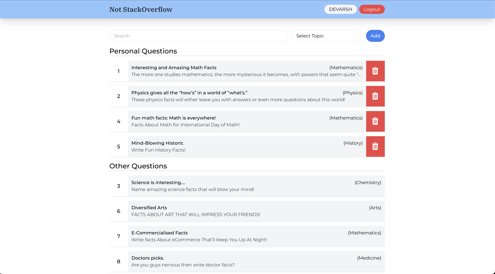

# Not Stack Overflow

Full stack application developed as alternative to popular StackOverFlow platform. This project can be run in local environment using Docker.

## Commands

1. Create: `docker compose up -d --build`
2. Destroy: `docker compose down --rmi all`

## Screenshot

